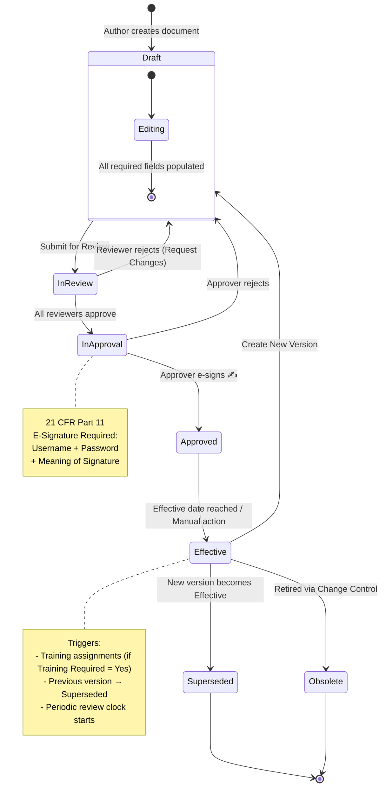
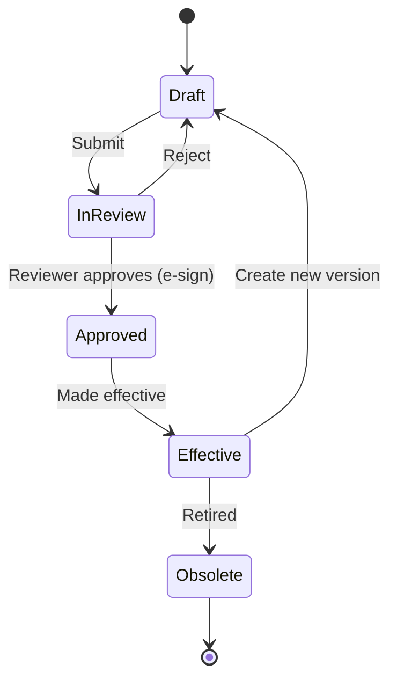
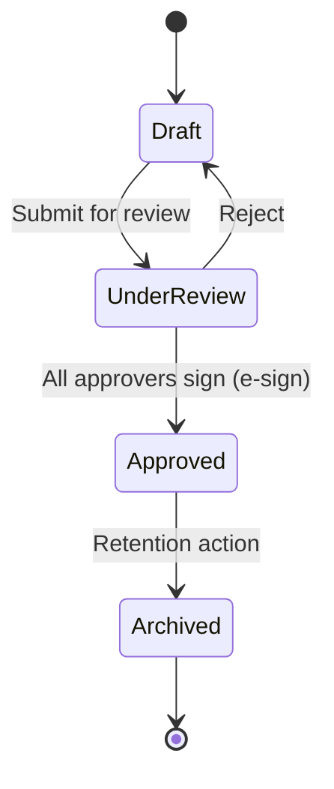
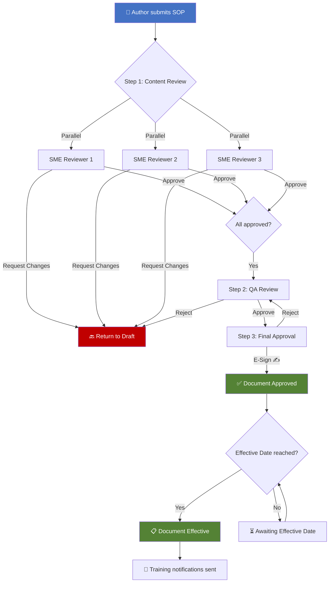

# NovaPharma Vault QualityDocs Implementation

> End-to-end Veeva Vault QualityDocs configuration design for a pharmaceutical company's GxP document management system — covering document types, lifecycles, workflows, security, and validation.

## 📋 Project Overview

This project simulates a real-world Veeva Vault QualityDocs implementation for **NovaPharma Inc.**, a fictional mid-size pharmaceutical manufacturer. It demonstrates the complete functional design process that a Vault consultant performs before system configuration begins.

### Business Context

NovaPharma manages ~8,000 controlled documents across two manufacturing sites using a legacy SharePoint + paper-based system. Following an FDA Form 483 observation citing inadequate document control, the company is migrating to Veeva Vault QualityDocs to:

- Centralize GxP document management across all sites
- Automate review/approval workflows (reducing cycle time from 15–20 days to 5–7 days)
- Achieve FDA 21 CFR Part 11 compliance for electronic records and signatures
- Enable automated periodic review tracking

## 📁 Repository Structure

```
novapharma-vault-qualitydocs/
├── README.md                          ← You are here
├── docs/
│   └── NovaPharma_Vault_QualityDocs_FRD.docx   ← Functional Requirements Document (35+ requirements)
├── config/
│   └── NovaPharma_Vault_Configuration_Workbook.xlsx  ← 8-tab configuration workbook
├── diagrams/
│   ├── gxp_document_lifecycle.md      ← Lifecycle state diagram (Mermaid)
│   ├── sop_review_workflow.md         ← SOP review/approval workflow (Mermaid)
│   └── security_matrix.md            ← Access control matrix
└── uat-scripts/
    └── uat_test_cases.md              ← 20 UAT test scripts
```

## 📊 Configuration Workbook Summary

The Configuration Workbook (`config/NovaPharma_Vault_Configuration_Workbook.xlsx`) contains 8 tabs:

| Tab | Contents |
|-----|----------|
| **Cover Page** | Project metadata, revision history |
| **Document Types** | 15 document types across 6 categories with naming conventions, retention rules |
| **Lifecycles** | 3 lifecycle definitions (GxP Document, Form, Report) with 16 state entries |
| **Workflows** | 5 workflow definitions with parallel/sequential routing and escalation rules |
| **Roles & Permissions** | 10 roles from Document Author to VP Quality (color-coded) |
| **Security Matrix** | Role × Lifecycle State access control grid |
| **Custom Metadata** | 12 custom fields with picklist values and validation rules |
| **UAT Test Scripts** | 20 test cases covering all functional areas |

## 🔄 Document Lifecycle Design

### GxP Document Lifecycle (SOPs, Work Instructions, Policies, Specifications)



### Form / Template Lifecycle



### Report Lifecycle



## ⚙️ Workflow Design

### WF-001: SOP Review & Approval Workflow



### Workflow Escalation Rules

| Workflow Step | Due Date | Reminder | Escalation |
|--------------|----------|----------|------------|
| Content Review (SME) | 5 business days | Auto-remind at Day 3 | Escalate to QA Manager at Day 5 |
| QA Review | 3 business days | Auto-remind at Day 2 | Escalate to QA Head |
| Final Approval | 3 business days | Auto-remind at Day 2 | Escalate to VP Quality at Day 5 |
| Periodic Review (Owner) | 10 business days | Auto-remind at Day 7 | Escalate to QA Head |

## 🔐 Security Matrix

Access permissions are determined by the intersection of **User Role** and **Document Lifecycle State**:

| State | Author | Reviewer | Approver | QA Admin | Dept Head | Read-Only | External Auditor |
|-------|--------|----------|----------|----------|-----------|-----------|------------------|
| **Draft** | Read/Edit/Delete | ❌ | ❌ | Full | ❌ | ❌ | ❌ |
| **In Review** | Read Only | Read/Annotate | ❌ | Full | Read Only | ❌ | ❌ |
| **In Approval** | Read Only | Read Only | Read/E-Sign | Full | Read/E-Sign | ❌ | ❌ |
| **Approved** | Read/Download | Read/Download | Read/Download | Full | Read/Download | Read Only | ❌ |
| **Effective** | Read/Download | Read/Download | Read/Download | Full | Read/Download | Read/Download | Read Only |
| **Superseded** | Read Only | Read Only | Read Only | Full | Read Only | Read Only | Read Only |
| **Obsolete** | ❌ | ❌ | ❌ | Full | Read Only | ❌ | ❌ |

## 📑 Document Types

| Type | Subtypes | Naming Convention | Regulatory Reference |
|------|----------|-------------------|---------------------|
| Standard Operating Procedure | Quality, Manufacturing, Laboratory | SOP-[DEPT]-XXXX-vX.X | 21 CFR Part 211 |
| Work Instruction | Production, Laboratory | WI-[DEPT]-XXXX-vX.X | 21 CFR Part 211 |
| Policy | Quality, EHS | POL-[DEPT]-XXXX-vX.X | ICH Q10 |
| Form | Batch Record, Deviation, Change Control | FRM-[TYPE]-XXXX-vX.X | 21 CFR Part 211.188 |
| Specification | Raw Material, Finished Product | SPEC-[TYPE]-XXXX-vX.X | 21 CFR Part 211.84 |
| Report | Validation, Annual Product Review | RPT-[TYPE]-XXXX-vX.X | 21 CFR Part 211.68 |

## 📝 Custom Metadata Fields

| Field | API Name | Type | Required | Description |
|-------|----------|------|----------|-------------|
| Effective Date | `effective_date__c` | Date | Yes (at Approval) | Date document becomes active |
| Department | `department__c` | Picklist | Yes | Quality, Manufacturing, Laboratory, RA, R&D, Supply Chain, EHS, IT |
| Document Owner | `document_owner__c` | User Reference | Yes | Responsible for content and periodic review |
| Training Required | `training_required__c` | Yes/No | Yes | Triggers training assignments when Effective |
| GxP Classification | `gxp_classification__c` | Picklist | Yes | GxP, Non-GxP, Reference |
| Review Cycle | `review_cycle_months__c` | Number | Yes | Periodic review frequency (default: 24 months) |
| Change Control # | `change_control_number__c` | Text | No | Link to initiating change control |
| Regulatory Market | `regulatory_market__c` | Multi-picklist | No | US FDA, EU EMA, Health Canada, MHRA, TGA, PMDA, ANVISA |
| Site | `site__c` | Picklist | Yes | NovaPharma HQ (Boston), Mfg Plant (NJ), R&D (CA), QC Lab (NJ) |

## ✅ UAT Test Coverage

20 test cases across 10 functional areas:

| Area | Test Cases | Key Scenarios |
|------|-----------|---------------|
| Document Creation | TC-001, TC-002 | Create SOP, mandatory field validation |
| Lifecycle Transitions | TC-003, TC-007 | Submit for review, make effective |
| Workflow - Review | TC-004, TC-005 | Approve, reject back to draft |
| Workflow - Approval | TC-006 | E-signature approval (21 CFR Part 11) |
| Security / Access Control | TC-008, TC-009 | Read-only restrictions, auditor access |
| Version Control | TC-010 | Create new version of effective document |
| Metadata | TC-011 | Custom field validation |
| Reporting | TC-012 | Document status report by department |
| Audit Trail | TC-013 | Full audit trail verification |
| Periodic Review | TC-014 | Auto-triggered review workflow |
| Document Retirement | TC-015 | Obsolete with change control |
| Naming Convention | TC-016 | Auto-generated document numbers |
| Template Usage | TC-017 | Create from controlled template |
| Bulk Operations | TC-018 | Vault Loader metadata update |
| Search | TC-019 | Advanced metadata search |
| 21 CFR Part 11 | TC-020 | E-signature compliance verification |

## 📚 Regulatory Compliance Framework

This implementation is designed to comply with:

| Regulation | Relevance |
|-----------|-----------|
| **FDA 21 CFR Part 11** | Electronic records and signatures — e-sign on approval, audit trails, access control |
| **FDA 21 CFR Part 211** | cGMP for pharmaceuticals — document control, retention, change management |
| **ICH Q10** | Pharmaceutical Quality System — knowledge management, change control, CAPA |
| **EU GMP Annex 11** | Computerized systems — validation, data integrity, access control |
| **GAMP 5** | Validation methodology — Category 4 (Configured Product) validation approach |

## 🛠 Tools & Technologies

- **Veeva Vault QualityDocs** — Target document management platform
- **Vault Loader** — Bulk data operations tool
- **Vault REST API** — Integration and migration
- **VQL (Vault Query Language)** — Data querying and reporting
- **GAMP 5 V-Model** — Validation methodology (FRD → CS → IQ/OQ/PQ)

## 👤 Author

**Meghana U** — Veeva Vault Consultant | Java Full Stack Developer  
Building expertise in life sciences technology, Vault platform configuration, and pharmaceutical compliance.

---

*This is an independent project demonstrating Veeva Vault implementation design skills. NovaPharma Inc. is a fictional company created for this exercise.*
